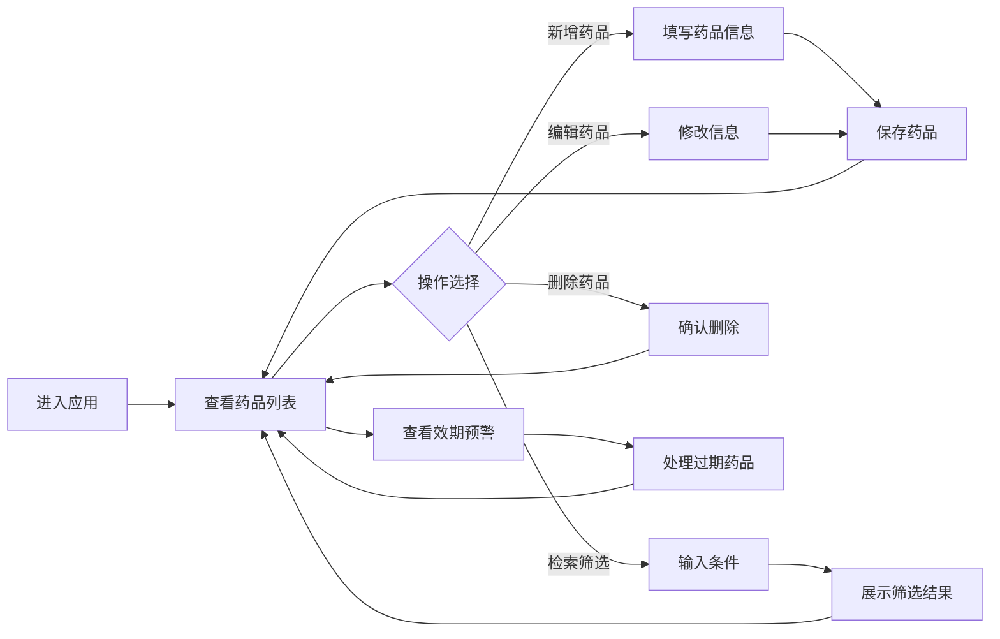

## 1. 产品概述

家庭常备药品有效期管理系统，帮助用户高效管理家中药品，通过效期预警避免药品过期浪费，提升家庭用药安全性。

- 解决问题：家庭药品存放分散、效期遗忘、过期浪费、用药安全隐患
- 目标用户：家庭用户，尤其适合有老人、儿童或慢性病患者的家庭
- 产品价值：数字化管理药品库存，智能预警过期风险，守护家人用药安全

## 2. 核心功能

### 2.1 用户角色

| 角色 | 注册方式 | 核心权限 |
|------|----------|----------|
| 家庭用户 | 无需注册，本地存储 | 药品录入、编辑、删除、查询、预警查看 |

### 2.2 功能模块

1. **药品管理主页面**：药品列表展示、效期预警标记、统计概览
2. **药品录入/编辑**：药品分类、基本信息、有效期、存放位置、用药备注
3. **检索筛选**：关键字搜索、分类筛选、效期状态筛选
4. **效期预警**：自动计算剩余天数、三色预警标记、即将过期提醒

### 2.3 页面详情

| 页面名称 | 模块名称 | 功能描述 |
|---------|----------|----------|
| 药品管理主页 | 顶部统计卡片 | 药品总数、即将过期数、已过期数、分类统计 |
| 药品管理主页 | 检索筛选栏 | 关键词搜索、分类下拉筛选、效期状态筛选 |
| 药品管理主页 | 药品列表 | 卡片式展示药品信息、效期预警色标、操作按钮 |
| 药品录入弹窗 | 基础信息 | 药品名称、分类、规格、生产厂家 |
| 药品录入弹窗 | 效期管理 | 生产日期、有效期至、自动计算剩余天数 |
| 药品录入弹窗 | 存放管理 | 存放位置、数量 |
| 药品录入弹窗 | 用药备注 | 适用症状、用法用量、注意事项 |
| 药品详情弹窗 | 完整信息 | 展示药品全部信息、用药备注、操作历史 |

## 3. 核心流程

用户进入应用后，首页展示所有药品列表和效期预警统计。可通过顶部搜索和筛选快速定位药品，点击卡片查看详情或进行编辑。系统自动标记即将过期和已过期药品，提醒用户及时处理。

## 4. 用户界面设计

### 4.1 设计风格

**配色方案（柔和医用主题）**：
- 主色：医疗蓝 `#4A90D9`（信任、专业）
- 辅助色：薄荷绿 `#7ECFC0`（健康、舒缓）
- 预警色：
  - 正常：柔和绿 `#8BC34A`
  - 即将过期（<30天）：暖橙 `#FFB74D`
  - 已过期：柔红 `#EF9A9A`
- 背景色：淡蓝灰 `#F5F7FA`
- 卡片背景：纯白 `#FFFFFF`
- 文字色：深灰 `#37474F`、中灰 `#78909C`

**组件风格**：
- 按钮：圆润圆角（8px）、轻量阴影、柔和悬停效果
- 卡片：大圆角（12px）、柔和投影、悬浮微动效
- 输入框：细边框、聚焦时主色光晕
- 标签：胶囊形、柔和填充色

**字体**：
- 标题：思源黑体 CN Bold，20-28px
- 正文：思源黑体 CN Regular，14-16px
- 辅助文字：思源黑体 CN Light，12-13px

**布局风格**：
- 顶部导航栏 + 主内容区
- 响应式卡片网格布局
- 充足留白，清爽通透

**图标风格**：
- 使用 Element Plus 内置图标
- 统一线性风格，柔和配色
- 药品分类使用差异化图标

### 4.2 页面设计概览

| 页面名称 | 模块名称 | UI 元素 |
|---------|----------|---------|
| 药品管理主页 | 顶部统计 | 4张渐变统计卡片，数字动画，图标点缀 |
| 药品管理主页 | 筛选栏 | 搜索框+分类筛选+状态筛选，横向排列 |
| 药品管理主页 | 药品列表 | 响应式卡片网格，效期色带标记，悬停上浮 |
| 药品录入弹窗 | 表单布局 | 分组标签页，清晰信息层级 |
| 预警标记 | 状态徽章 | 三色胶囊标签，闪烁动画（即将过期） |

### 4.3 交互动效

- 页面加载：卡片淡入、数字滚动计数
- 悬停效果：卡片上浮 4px、阴影加深
- 新增/编辑：弹窗缩放进入
- 预警提示：即将过期标签轻微呼吸动效
- 操作反馈：按钮点击波纹、成功 Toast 提示

### 4.4 响应式设计

- **桌面端（≥1200px）**：4列卡片网格，侧边统计区
- **平板端（768-1199px）**：2-3列卡片网格
- **移动端（<768px）**：单列卡片布局，筛选栏折叠

