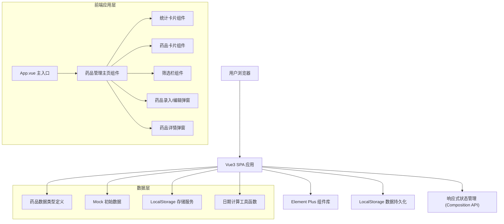

## 1. 架构设计



## 2. 技术描述

- **前端框架**：Vue@3.4 + Composition API + `<script setup>` 语法
- **构建工具**：Vite@5.0
- **UI 组件库**：Element Plus@2.4（按需自动导入）
- **样式方案**：原生 CSS 变量 + SCSS
- **图标**：@element-plus/icons-vue
- **数据存储**：浏览器 LocalStorage（无需后端）
- **开发语言**：TypeScript@5.0

## 3. 目录结构

```
d:\lhd017\
├── src\
│   ├── components\
│   │   ├── StatsCard.vue          # 统计卡片组件
│   │   ├── MedicineCard.vue       # 药品卡片组件
│   │   ├── FilterBar.vue          # 筛选栏组件
│   │   ├── MedicineForm.vue       # 药品录入表单
│   │   └── MedicineDetail.vue     # 药品详情弹窗
│   ├── types\
│   │   └── medicine.ts            # 类型定义
│   ├── utils\
│   │   ├── date.ts                # 日期计算工具
│   │   └── storage.ts             # LocalStorage 封装
│   ├── data\
│   │   └── mockData.ts            # Mock 初始数据
│   ├── composables\
│   │   └── useMedicine.ts         # 药品管理组合式函数
│   ├── App.vue                    # 根组件
│   ├── main.ts                    # 入口文件
│   └── styles\
│       ├── variables.scss         # CSS 变量
│       └── global.scss            # 全局样式
├── index.html
├── vite.config.ts
├── tsconfig.json
└── package.json
```

## 4. 类型定义

```typescript
// 药品分类
type MedicineCategory = 
  | 'cold'        // 感冒药
  | 'fever'       // 退烧药
  | 'stomach'     // 肠胃药
  | 'antibiotic'  // 抗生素
  | 'external'    // 外用药
  | 'chronic'     // 慢性病用药
  | 'health'      // 保健品
  | 'other'       // 其他

// 效期状态
type ExpiryStatus = 'normal' | 'warning' | 'expired'

// 药品数据模型
interface Medicine {
  id: string
  name: string              // 药品名称
  category: MedicineCategory // 分类
  specification: string     // 规格
  manufacturer: string      // 生产厂家
  productionDate: string    // 生产日期 YYYY-MM-DD
  expiryDate: string        // 有效期至 YYYY-MM-DD
  quantity: number          // 数量
  storageLocation: string   // 存放位置
  symptoms: string          // 适用症状
  usage: string             // 用法用量
  notes: string             // 注意事项
  createdAt: string         // 创建时间
  updatedAt: string         // 更新时间
}

// 筛选条件
interface FilterOptions {
  keyword: string
  category: MedicineCategory | ''
  expiryStatus: ExpiryStatus | ''
}

// 统计数据
interface Statistics {
  total: number
  warning: number
  expired: number
  categories: Record<MedicineCategory, number>
}
```

## 5. 核心功能实现

### 5.1 效期预警算法

```typescript
// 根据有效期计算状态和剩余天数
function calculateExpiryStatus(expiryDate: string): {
  status: ExpiryStatus
  daysLeft: number
} {
  const today = new Date()
  const expiry = new Date(expiryDate)
  const diffTime = expiry.getTime() - today.getTime()
  const daysLeft = Math.ceil(diffTime / (1000 * 60 * 60 * 24))
  
  if (daysLeft < 0) {
    return { status: 'expired', daysLeft }
  } else if (daysLeft <= 30) {
    return { status: 'warning', daysLeft }
  } else {
    return { status: 'normal', daysLeft }
  }
}
```

### 5.2 LocalStorage 封装

```typescript
const STORAGE_KEY = 'family-medicine-list'

function getMedicineList(): Medicine[] {
  const data = localStorage.getItem(STORAGE_KEY)
  return data ? JSON.parse(data) : []
}

function saveMedicineList(list: Medicine[]): void {
  localStorage.setItem(STORAGE_KEY, JSON.stringify(list))
}
```

## 6. 配置文件要点

### vite.config.ts

```typescript
import { defineConfig } from 'vite'
import vue from '@vitejs/plugin-vue'
import AutoImport from 'unplugin-auto-import/vite'
import Components from 'unplugin-vue-components/vite'
import { ElementPlusResolver } from 'unplugin-vue-components/resolvers'

export default defineConfig({
  plugins: [
    vue(),
    AutoImport({
      resolvers: [ElementPlusResolver()],
      imports: ['vue'],
    }),
    Components({
      resolvers: [ElementPlusResolver()],
    }),
  ],
  server: {
    port: 3000,
    open: true,
  },
})
```

## 7. 依赖清单

```json
{
  "dependencies": {
    "vue": "^3.4.0",
    "element-plus": "^2.4.4",
    "@element-plus/icons-vue": "^2.3.1"
  },
  "devDependencies": {
    "@vitejs/plugin-vue": "^5.0.0",
    "vite": "^5.0.0",
    "typescript": "^5.3.0",
    "sass": "^1.69.0",
    "unplugin-auto-import": "^0.17.2",
    "unplugin-vue-components": "^0.26.0"
  }
}
```

